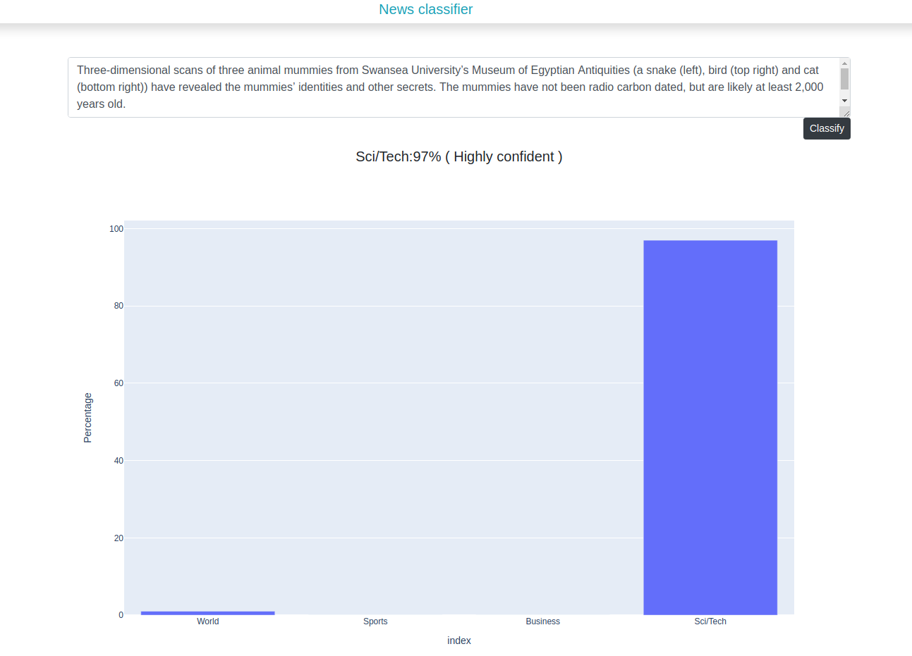

# News-classification-webapp
Web app to classify given News

## App interface:
Here is look of app

## Deploying on cloud or heroku
Branch ``deploy`` is suitable for deploying on heroku 
or any cloud services. Because of high cpu usage, Heroku may fail 
after some time so It is recommend to use  on local machine or any other cloud 
services like aws or use it .

## working on local
Please use following guidelines to run on local.

* first install the required libraries inside a virtual environment:

* `pip install -r requirements.txt`

To run app use:
* ``flask run`` or ``python app.py``

## More improvements/ finetuning
It is simple app, However it can be make better
 theres always a way to make it better. 
 
 
 ## References
 I've taken data from https://www.kaggle.com/amananandrai/ag-news-classification-dataset

## License
GPL-v3 
